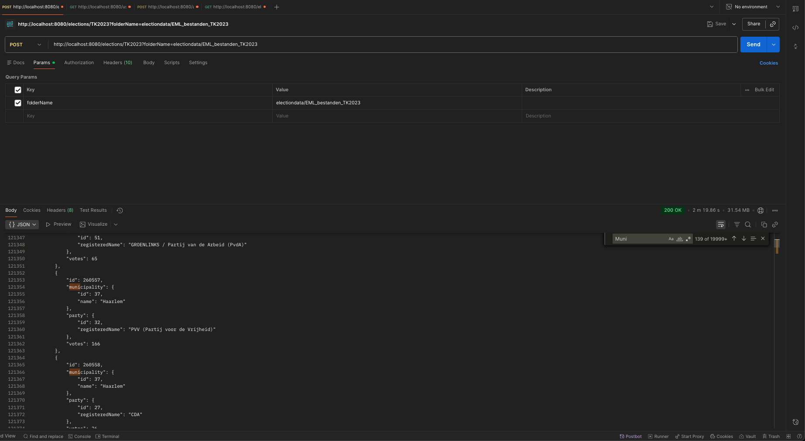

# API endpoint overview

## System Architecture Overview

This project allows users to view Dutch election results from various years. 
Users can also discuss these with other users.

### Architectuur Diagram

```
[Frontend (TS,VUE.JS)] <-- HTTP/HTTPS --> [Spring Boot Rest API] <-- --> [Database]
                                            
                                         
```

## Technical Components

### Frontend Infrastructuur
- **Technology**: Vanilla TypeScript + Vue.js + tailwind Css
- **Location**: `/frontend/src/`
- **Components** (`/components/`): Reusable UI elements in Vue.js
- **Services** (`/services/`): API communication to the backend
- **Assets** (`/assets/`):  Static files like images and stylesheets
- **Views** (`/views/`): Different pages of the application
- **Router** (`/router/`): Manages navigation between views
- **Stores** (`/stores/`): Vuex store for managing application state
- **Interfaces** (`/interfaces/`): TypeScript interfaces for type definitions
- **Composables** (`/composables/`): Reusable logic using Vue 3 Composition API

### Backend Infrastructuur

- **Technology**: Java + Spring Boot + Rest API
- **Location**: `/backend/src/main/java`
- **Config** (`/config/`): Configuration classes for Spring Boot
- **Controllers** (`/controllers/`): Handle incoming HTTP requests and route them to services
- **Services** (`/services/`): Business logic and interaction with repositories
- **Repositories** (`/repositories/`): Data access layer, interacting with the database
- **Models** (`/models/`): Java classes representing database entities
- **DTOs** (`/dtos/`): Data Transfer Objects for transferring data between
- **Utils** (`/utils/`): Utility classes and helper functions

## Communicatie Protocollen

### Frontend ↔ Backend Communicatie

- **Protocol**: HTTP/HTTPS
- **Format**: JSON
- **Endpoints**: RESTfull API endpoints defined in the backend controllers
- **Authentication**: JWT (JSON Web Tokens) for secure communication
- **Error Handling**: Standard HTTP status codes with error messages in JSON format
- **CORS**: Configured in the backend to allow requests from the frontend domain

## Endpoint Overview

### I used POSTMAN to create the API endpoints. Below is one example of me using POSTMAN to test the API endpoints. I've chosen to document the rest of the endpoints in Mardown format for better clarity and ease of reading.

   

### Endpoints

#### Authentication

| Method | Endpoint | Description | Auth Required | Request Body | Response | Status Codes |
|--------|----------|-------------|---------------|--------------|----------|--------------|
| POST | /user | Create new user | No | User object (username, email, password) | User object (without password) | 201 Created, 400 Bad Request |
| POST | /user/verify | Verify credentials and get JWT token | No | User object (email OR username, password) | {success: boolean, token: string, user: object} | 200 OK, 401 Unauthorized |
| GET | /user/{userId} | Get user by ID | Yes (JWT) | Path param: userId (Integer) | User object (without password) | 200 OK, 404 Not Found, 401 Unauthorized |

#### POST /user

Create a new user account.

Authentication Required: No

Request Body:
{
"username": "johndoe",
"email": "user@example.com",
"password": "securePassword123"
}

Success Response (201 Created):
{
"id": 1,
"username": "johndoe",
"email": "user@example.com"
}

Status Codes:
- 201: User created successfully
- 400: Invalid input data
- 500: Server error

#### POST /user/verify

Verify user credentials and receive JWT token.

Authentication Required: No

Request Body:
{
"email": "user@example.com",
"username": "johndoe",
"password": "securePassword123"
}

Note: Provide either email OR username, not both.

Success Response (200 OK):
{
"success": true,
"token": "eyJhbGciOiJIUzI1NiIsInR5cCI6IkpXVCJ9...",
"user": {
"email": "user@example.com",
"username": "johndoe"
}
}

Error Response (401 Unauthorized):
{
"success": false,
"message": "Invalid credentials"
}

Status Codes:
- 200: Authentication successful
- 401: Invalid credentials
- 400: Missing required fields
- 500: Server error

#### GET /user/{userId}

Get user details by ID.

Authentication Required: Yes (JWT token in Authorization header)

Path Parameters:
- userId (Integer): The user's unique identifier

Success Response (200 OK):
{
"id": 1,
"username": "johndoe",
"email": "user@example.com"
}

Status Codes:
- 200: User found
- 404: User not found
- 401: Not authenticated
- 500: Server error