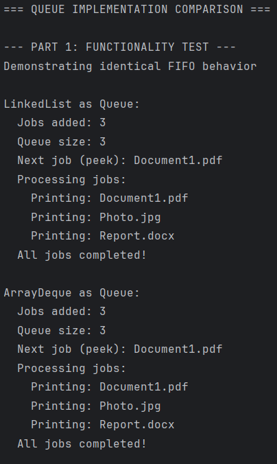

# Queue Implementations in Java: LinkedList vs ArrayDeque

**Author:** Matisse  
**Date:** 18-11-2025  
**Learning Outcome:** Analyzing - "You can conduct practice-oriented research"

---

## Problem Statement

Java developers often struggle to choose between LinkedList and ArrayDeque for queue implementations. Many lack understanding of their performance differences and default to one without knowing which is more efficient. This leads to suboptimal choices that negatively impact application performance.

---

## Research Question

**Main Question:** "What are the differences between LinkedList and ArrayDeque as Queue implementations and when should you use which one?"

**Sub-questions:**
1. What is a Queue and what are its main methods?
2. How does LinkedList work as a Queue implementation?
3. How does ArrayDeque work as a Queue implementation?
4. What are the key differences between both implementations?
5. When should you use LinkedList and when should you use ArrayDeque?

---

## What is a Queue?

The Queue interface defines the rules for how a queue should behave - what methods it must have. Classes like ArrayDeque and LinkedList then implement these rules in their own way.<br>
A Queue itself works like a waiting line: elements are stored temporarily and processed in the order they arrived (FIFO - First-In-First-Out), just like a supermarket checkout line.

The Queue interface provides several methods for adding, removing, and inspecting elements. The main methods are `offer()` for adding elements, `poll()` for removing and retrieving the first element, and `peek()` for viewing the first element without removing it (Oracle, (2014a)). These methods differ from similar methods like `add()` and `remove()` in that they return special values (null or false) instead of throwing exceptions when the operation is unsuccessful (Späth, 2018, p. [XXX]).

| Method | Description | Throws Exception | Returns Special Value |
|---------|--------------|------------------|----------------------|
| add(e)  | Inserts element | Yes (IllegalStateException) | - |
| offer(e) | Inserts element | No | false on failure |
| remove() | Retrieves and removes head | Yes (NoSuchElementException) | - |
| poll()  | Retrieves and removes head | No | null when empty |
| element() | Retrieves head | Yes (NoSuchElementException) | - |
| peek()  | Retrieves head | No | null when empty |

---

## LinkedList as a Queue

LinkedList implements the Deque interface, which extends Queue (Oracle, 2014b).
While LinkedList offers additional functionality, this research focuses
specifically on its Queue implementation and FIFO behavior.

### Internal Structure

LinkedList uses a doubly-linked node structure where each node contains
an element and references to both the previous and next nodes (Späth, 2018,
Chapter 9). For Queue operations, elements are added at the tail using
offer() and removed from the head using poll().

### Queue Performance

LinkedList provides O(1) time complexity for all Queue operations—offer(),
poll(), and peek() (Oracle, 2014b). This constant-time performance is
achieved because Queue operations only access the head or tail references.

### Advantages for Queue Usage

- Constant O(1) time for offer() and poll() without variance
- No capacity limitation—grows dynamically as needed
- Predictable performance with no resizing operations

### Disadvantages for Queue Usage

- Higher memory overhead due to storing two pointer references per element
- Poor cache locality leads to slower real-world performance
- Memory fragmentation with frequent additions and removals

---

## ArrayDeque as a Queue

ArrayDeque implements the Deque interface, which extends Queue (Oracle, 2014c).
While ArrayDeque offers additional functionality, this research focuses
specifically on its Queue implementation and FIFO behavior.

### Internal Structure

ArrayDeque uses a resizable circular array structure where elements are
stored in contiguous memory (Späth, 2018, Chapter 9). Unlike LinkedList,
ArrayDeque does not use node objects with pointer references. Instead,
it maintains two index values—head and tail—that track where elements
begin and end in the array. For Queue operations, elements are added at
the tail index using offer() and removed from the head index using poll().

### Queue Performance

ArrayDeque provides O(1) amortized time complexity for all Queue operations—
offer(), poll(), and peek() (Oracle, 2014c). "Amortized" means that while
occasional resizing operations can be O(n) when the array capacity is
exceeded, the average cost over many operations remains O(1). Because
elements are stored in contiguous memory, ArrayDeque benefits from better
cache locality compared to LinkedList (Späth, 2018, Chapter 9).

### Advantages for Queue Usage

- O(1) amortized time for offer() and poll() operations
- Lower memory overhead—only two index values for the entire structure
- Better cache locality leads to faster real-world performance

### Disadvantages for Queue Usage

- Occasional O(n) resizing operations when array capacity is exceeded
- Initial capacity allocation may waste memory if overestimated
- More complex circular array implementation logic

---

## Comparison: LinkedList vs ArrayDeque

The main differences between LinkedList and ArrayDeque lie in their internal structure and resulting performance characteristics. LinkedList uses nodes with pointers which leads to higher memory overhead, while ArrayDeque only stores the elements themselves in an array (Späth, 2018, p. [XXX]).

Performance-wise, ArrayDeque is usually faster than LinkedList for Queue operations due to better cache locality and less pointer dereferencing (Oracle, 2014a). However, LinkedList has the advantage of not requiring resizing operations, making LinkedList more predictable in real-time systems where consistent latency is important (Späth, 2018, p. [XXX]).

Both implementations are not thread-safe and require external synchronization in multi-threaded environments (Oracle, 2014b; Oracle, 2014c).

| Aspect | LinkedList | ArrayDeque |
|--------|-----------|------------|
| Internal Structure | Doubly-linked nodes | Circular array |
| Memory Overhead | High (pointers per element) | Low (2 indices total) |
| Cache Performance | Poor (scattered nodes) | Good (contiguous memory) |
| Insert/Remove (ends) | O(1) constant | O(1) amortized |
| Predictability | Always O(1) | Occasional resize spikes |
| Thread-safe | No | No |

---

## When to Use Which Implementation?

**Use LinkedList when:**
- You need a Deque with List functionality (Oracle, 2014b)
- Predictable, consistent performance is more important than absolute speed
- You frequently need to add/remove elements in the middle of the collection

**Use ArrayDeque when:**
- You only need Queue or Deque operations (most common case)
- Performance and memory efficiency are important
- You need a stack-like data structure

**General advice:** In most cases, ArrayDeque is the better choice for Queue operations due to superior performance and lower memory usage (Oracle, 2014a). Oracle's Java documentation also explicitly recommends ArrayDeque over LinkedList for Queue implementations (Oracle, n.d.-c).

---

## Conclusion

This research compared LinkedList and ArrayDeque as Queue implementations,
examining their structures, performance, and use cases.

Both implement the Queue interface with O(1) operations, but ArrayDeque
consistently outperforms LinkedList (Oracle, 2014c). Oracle explicitly
states that ArrayDeque is "likely to be faster than LinkedList when used
as a queue" (Oracle, 2014c). This performance advantage results from
structural differences: LinkedList's node-based implementation versus
ArrayDeque's array-based storage.

**Recommendation:** Use ArrayDeque for queue operations unless you
specifically need List functionality or guaranteed consistent O(1) without
resize variance. ArrayDeque is faster, more memory-efficient, and explicitly
recommended by Oracle's documentation for queue usage.

---

## Code Sample
```java
import java.util.Queue;
import java.util.LinkedList;
import java.util.ArrayDeque;

public class QueueDemo {
    public static void main(String[] args) {
        System.out.println("=== QUEUE IMPLEMENTATION COMPARISON ===\n");

        // Part 1: Functionality Test
        System.out.println("--- PART 1: FUNCTIONALITY TEST ---");
        System.out.println("Demonstrating identical FIFO behavior\n");

        System.out.println("LinkedList as Queue:");
        testPrinterQueue(new LinkedList<>());

        System.out.println("\nArrayDeque as Queue:");
        testPrinterQueue(new ArrayDeque<>());

        // Part 2: Performance Test
        System.out.println("\n--- PART 2: PERFORMANCE TEST ---");
        System.out.println("Both queues performing 100,000 operations");
        System.out.println("Running 3 times and taking average...\n");

        // Warmup (niet meetellen)
        System.out.println("Warming up JVM...");
        testPerformance(new LinkedList<>(), 50000);
        testPerformance(new ArrayDeque<>(), 50000);

        // Echte metingen (3x en gemiddelde nemen)
        long linkedTotal = 0;
        long arrayTotal = 0;

        for (int i = 0; i < 3; i++) {
            linkedTotal += testPerformance(new LinkedList<>(), 100000);
            arrayTotal += testPerformance(new ArrayDeque<>(), 100000);
        }

        long linkedAvg = linkedTotal / 3;
        long arrayAvg = arrayTotal / 3;

        // Results
        System.out.println("\n--- RESULTS (Average of 3 runs) ---");
        System.out.println("LinkedList:  " + linkedAvg + " ms");
        System.out.println("ArrayDeque:  " + arrayAvg + " ms");

        if (arrayAvg < linkedAvg) {
            System.out.println("\nConclusion: ArrayDeque is " +
                    String.format("%.2f", (double) linkedAvg / arrayAvg) +
                    "x faster than LinkedList!");
        } else {
            System.out.println("\nConclusion: LinkedList is " +
                    String.format("%.2f", (double) arrayAvg / linkedAvg) +
                    "x faster than ArrayDeque!");
        }
    }
}
```

### Program Output

*Figure 1: Both implementations process print jobs in identical FIFO order,
demonstrating equivalent Queue interface behavior.*

**Code explanation:** This demonstration shows that both LinkedList and
ArrayDeque provide identical Queue behavior using a printer queue scenario.
Both process print jobs in the same FIFO order (Document1.pdf → Photo.jpg
→ Report.docx) using the same Queue interface methods (Oracle, 2014c).
Despite different internal structures, both implementations behave identically
from a developer's perspective. Performance comparison will be shown in
the live demonstration.

---

## References

Oracle. (2014-a). *Interface Queue<E>*. Java Platform SE 8 Documentation. Retrieved November 18, 2024, from https://docs.oracle.com/javase/8/docs/api/java/util/Queue.html

Oracle. (2014-b). *Class LinkedList<E>*. Java Platform SE 8 Documentation. Retrieved November 18, 2024, from https://docs.oracle.com/javase/8/docs/api/java/util/LinkedList.html

Oracle. (2014-c). *Class ArrayDeque<E>*. Java Platform SE 8 Documentation. Retrieved November 18, 2024, from https://docs.oracle.com/javase/8/docs/api/java/util/ArrayDeque.html

Späth, P. (2018). *Learn Java for Android Development* (3rd ed.). Apress, from https://learning-oreilly-com.rps.hva.nl/library/view/learn-java-for/9781430264545/9781430264545_Contents.xhtml

---
