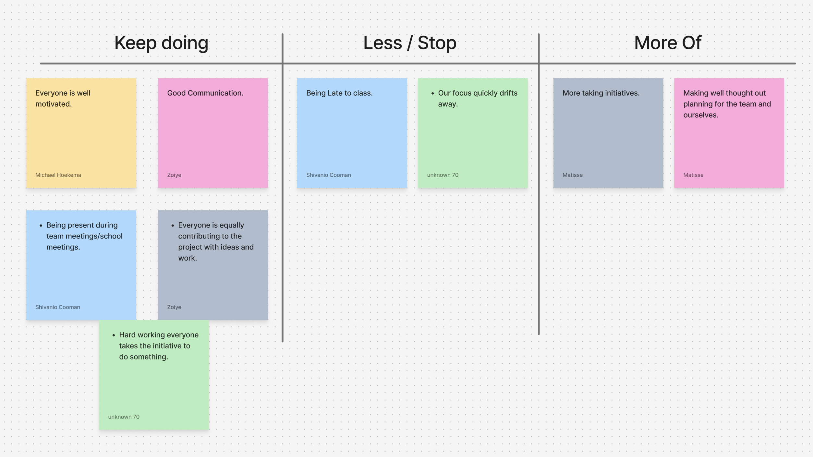
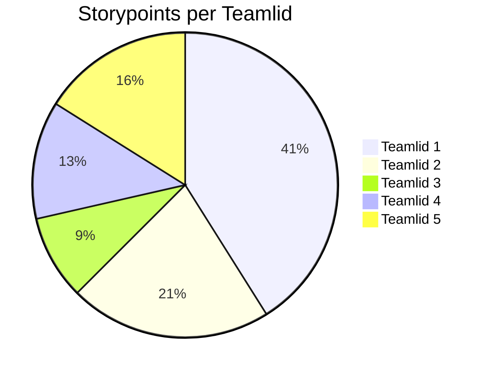

# Retrospective sprint 1 (18 sep 2025)

Little Starfish retrospective

## Outcome retrospective

- We should do better to get to school on time, getting there 5 or 10 minutes earlier instead of cutting it close everytime.
- We are often easily distracted, for example talking about offtopic subjects and not focusing on the task at hand. We should try to keep our focus more.
- We should try to take more initiative, we already do this quite well but we should keep it in mind.
- We should sit together more often and be more thoughtful about the planning of our tasks and do this on time instead of leaving it to the last minute.

<!--
## Contributions team members

// Geef per teamlid aan hoeveel storypoints of werk hij/zij deze sprint heeft kunnen realiseren. Vervang hieronder de namen van de teamleden en geef per teamlid het aantal storypoints. De mermaid code genereert vervolgens een pie-chart.

// Geef onder de pie chart een korte toelichting: wat valt op?  Kunnen jullie de verschillen verklaren?
-->

## Feedback for team members

### Feedback Zoiye

#### Tops

- Good communication
- Well involved within the team
- Very creative

#### Tips

- Try to be less distracted and more focused on the project
- Be on time.

### Feedback Michael

#### Tops

- Serious and helpful worker, takes care of his tasks
- Always on time

#### Tips

- Help the team more often
- Be more proactive in sharing ideas

### Feedback Batuhan

#### Tops

- Works well with others and is involved in the project
- Reliable, makes sure his tasks are completed on time

#### Tips

- Ask more questions if you don't understand something
- Be careful with AI usage (make sure you really learn from it)

### Feedback Matisse

#### Tops

- Disciplined
- Works attentively

#### Tips

- Try to always be on time or available

### Feedback Shivanio

#### Tops

- Motivated, very focused on the project
- Takes a lot of good initiative
-
#### Tips

None

## Development goal

### Batuhan's development goal:

I want to ask for help more quickly during the upcoming sprint when I get stuck. Specifically, this means that no later than half an hour after I can’t make progress, I will ask a teammate a question. I will keep a short log (in Obsidian) where I note when I got stuck, what question I asked, and to whom. This will help me work more efficiently and avoid wasting time.

## Matisse's development goal:

I want to be on time for all team meetings and classes during the upcoming sprint. Specifically, this means that I will be present before the official start time for every scheduled meeting (daily standups, sprint planning, sprint review) and all classes. To track this, I will keep a simple log where I note for each meeting and class whether I was on time or not. This will help me be a reliable teammate and contribute to efficient meetings and classes.
