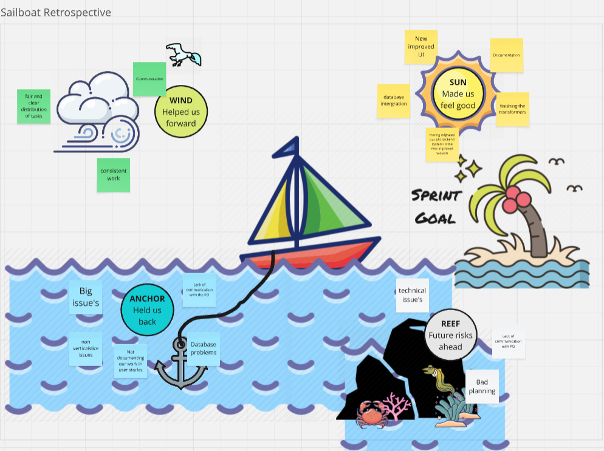
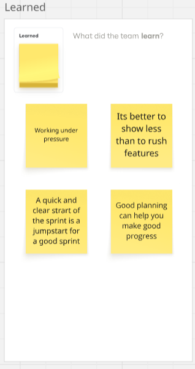
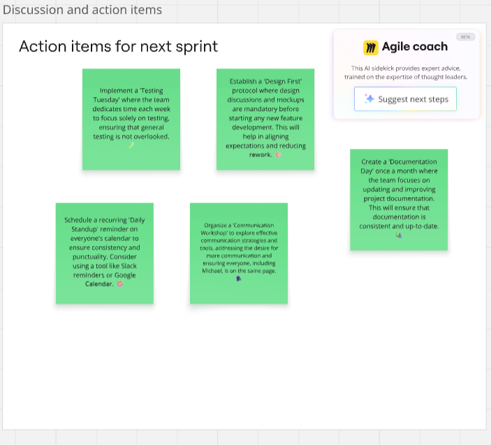

## Retrospective sprint 2

# **After dot voting**

# Sprint Retrospective - Dot Voting Conclusion

## 🎯 Team Priorities for Next Sprint

Based on dot voting results from the team:

### Voting Results

| Action Item | Votes | Priority |
|-------------|-------|----------|
| Testing Tuesday | 4 🔴🔴🔵🟡 | **Top Priority** |
| Design First Protocol | 4 🟣🔵🔴🟡 | **Top Priority** |
| Documentation Day | 3 🔴🟣🔵 | Second Priority |
| Daily Standup Reminder | 1 🟡 | Lower Priority |
| Communication Workshop | 1 🟡 | Lower Priority |

---

## 📊 Analysis

**Top Priorities (4 votes each - TIE):**
1. **Testing Tuesday** - The team strongly agrees testing needs dedicated time
2. **Design First Protocol** - Equally important - design before coding is critical

**Second Priority (3 votes):**
3. **Documentation Day** - Still important but slightly less urgent

**Lower Priorities (1 vote each):**
4. Daily Standup Reminder
5. Communication Workshop

---

## 🚀 Action Plan

### Sprint 3 (Next Sprint) - Focus on Top Priorities

**Implement BOTH:**
- ✅ **Testing Tuesday** - Dedicate time each week solely for testing
- ✅ **Design First Protocol** - Mandatory design discussions before coding

**Why both?**
- They complement each other perfectly
- Design first prevents rushed code → Testing catches remaining issues
- Both are quick to establish (just need team agreement + calendar setup)
- Clear team consensus with maximum votes

### Sprint 4 (Following Sprint)
- 📚 Add **Documentation Day** (implementation plan already ready!)

### Later Sprints
- 🔄 Revisit **Daily Standup** and **Communication Workshop** if still needed
- Reassess priorities based on Sprint 2

---

## ✅ Next Steps

**Immediate actions:**
1. Assign owners for Testing Tuesday implementation
2. Assign owners for Design First Protocol
3. Set up calendar reminders for both initiatives
4. Define success criteria for each action item

**Success Metrics:**
- Testing Tuesday: Track testing coverage week-over-week
- Design First: Count features with design mockups before coding
- Team satisfaction: Quick check-in at next retro

---

**Date:** [10-10-2025]  
**Team Size:** 4 people  
**Next Review:** End of next sprint  
**Retro Facilitator:** [Zoiye]